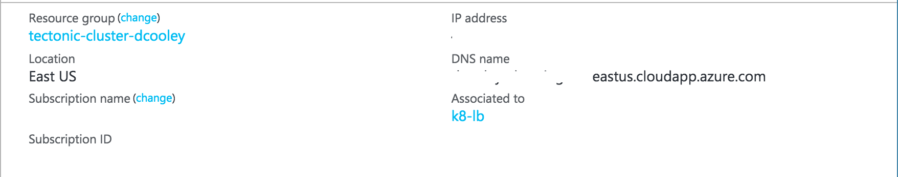
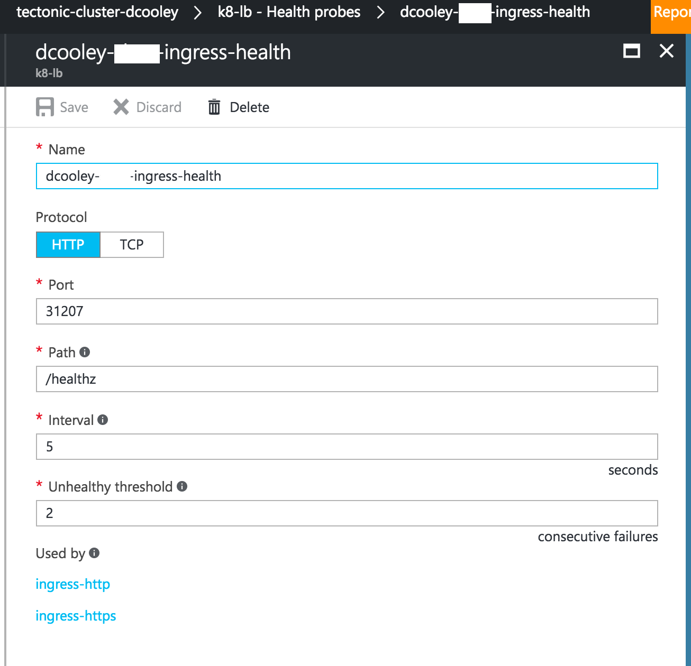
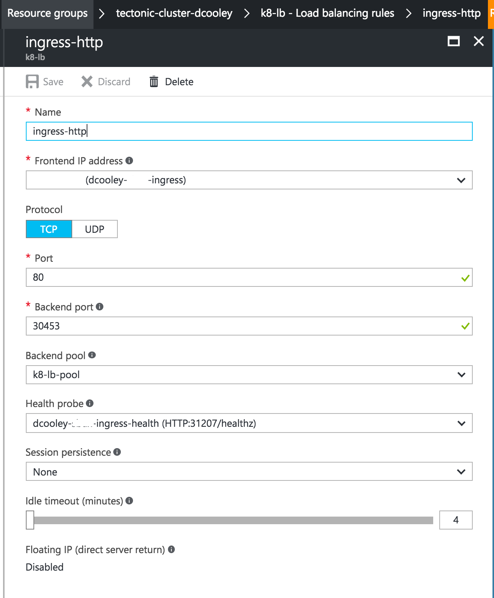
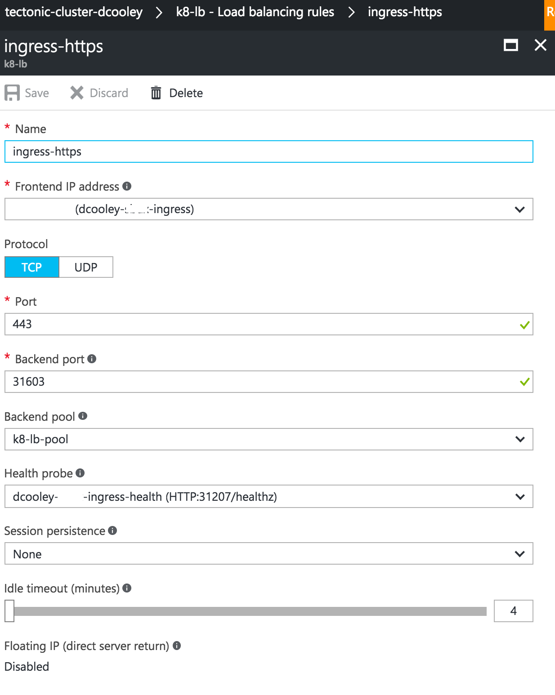
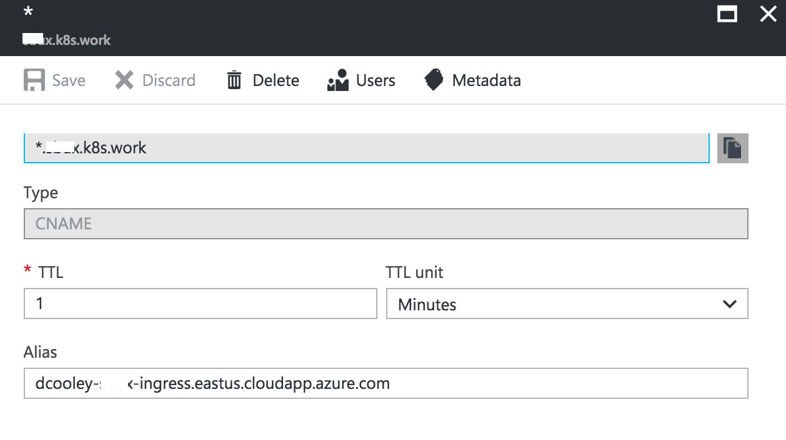

## Bring up a second ingress controller on your azure cluster:

1. Kubernetes:
	* Create the new Ingress Controller and Service.
	* Bring up test app.
	* Test test app.

1. Azure:
	* We will add a new public ip within the resource group and give it a name.
	* Map the new svc ports in Azure (Health, http and https).

1. DNS:
	* We will use a star type dns record to resolve the traffic back to the ingress controller.
	* This will leverage your subdomain and a cname record.

1. Profit!
	* test the app through the lb.

### Bonus:
1. kube-lego:
	* Use Helm to install kube-lego.
	* Apply the tls config to sample apps ingress controller.


## Kubernetes:
Let's create the Ingress Controller, Service the their dependencies.
```
kubectl create -f global-ingress/
```
I named this global ingress as it will watch in all namespaces for ingress resources to satisfy.

Next we are going to bring up the test app.
```
kubectl create -f test-app/
```

We can test that the app works in a number of ways:
* ssh into the controller and curl the nodeport of your service
```
$ ssh  core@dcooley-k8s.azure.ifup.org
Last login: Thu Mar 23 07:59:26 UTC 2017 from 66.235.1.41 on pts/0
Container Linux by CoreOS stable (1298.6.0)
core@tectonic-master-000001 ~ $ curl -v $(hostname):32002/healthz
*   Trying 10.0.0.6...
* TCP_NODELAY set
* Connected to tectonic-master-000001 (10.0.0.6) port 32002 (#0)
> GET /healthz HTTP/1.1
> Host: tectonic-master-000001:32002
> User-Agent: curl/7.52.1
> Accept: */*
>
< HTTP/1.1 200 OK
< Date: Thu, 23 Mar 2017 08:03:48 GMT
< Content-Length: 2
< Content-Type: text/plain; charset=utf-8
<
* Curl_http_done: called premature == 0
* Connection #0 to host tectonic-master-000001 left intact
ok
core@tectonic-master-000001 ~ $
```
* You can also use kube-proxy to connect to the service remotely:
```
$ kubectl proxy &
[1] 17226
$ curl http://127.0.0.1:8001/api/v1/proxy/namespaces/default/services/echoserver/
CLIENT VALUES:
client_address=10.2.3.0
command=GET
real path=/
query=nil
request_version=1.1
request_uri=http://10.2.0.12:8080/

SERVER VALUES:
server_version=nginx: 1.10.0 - lua: 10001

HEADERS RECEIVED:
accept=*/*
accept-encoding=gzip
host=10.2.0.12:8080
referer=
user-agent=Mozilla/5.0 (compatible; MSIE 9.0; Windows NT 6.1; Trident/5.0)
x-forwarded-for=127.0.0.1
x-forwarded-uri=/api/v1/proxy/namespaces/default/services/echoserver/
BODY:
-no body in request-
```

## Azure:
Create a new public ip and give it an alias.


Now to add some resources to the existing k8s-lb. We are using this as it already has the backend pool defined.

You can pull the port mapping back from kubernetes with:
```
$ kubectl get svc --namespace=kube-system global-ingress-lb
NAME                CLUSTER-IP    EXTERNAL-IP   PORT(S)                                      AGE
global-ingress-lb   10.3.68.165   <nodes>       443:31603/TCP,80:30453/TCP,10254:31207/TCP   1h
```

Health Probe:

Ingress Http:

Ingress Https:



## DNS:
Create a new dns record and use the star pattern. Set as the target the alias created in the previous step.
This will enable you to land any traffic that doesn't have a more specific record on your new ingress controller.
When we create the ingress resource we can now follow the hostname pattern and create any number of ingress resources.

**Be careful not to overlap.**



## Profit:
Test your app through the elb.

You can create other apps or hosts in the ingress resource file.
